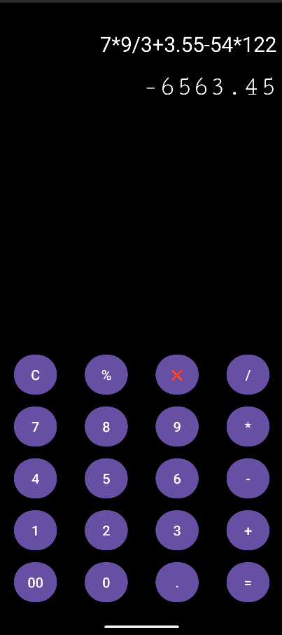

# 📱 Advanced Calculator App

A simple Android calculator application built with **Kotlin**.  
Supports basic arithmetic operations (`+`, `-`, `*`, `/`, `%`) and follows **BODMAS** rule for correct operator precedence.  
Includes a clean UI with delete, clear, and percentage functionality.  

---

## 🖼️ Screenshots
Here’s how the home screen looks:



---

## 🚀 Features
- Addition, subtraction, multiplication, division, and modulo (%).  
- Supports **decimal numbers**.  
- Follows **BODMAS** for accurate calculations.  
- Clear and delete buttons.  
- Responsive UI with smooth input handling.  

---

## 🛠️ Tech Stack
- **Language:** Kotlin  
- **UI:** XML with Android View Binding  
- **IDE:** Android Studio  

---

1. Clone the repository:
   ```bash
   git clone https://github.com/001kenji/kotlin-Calculator.git
